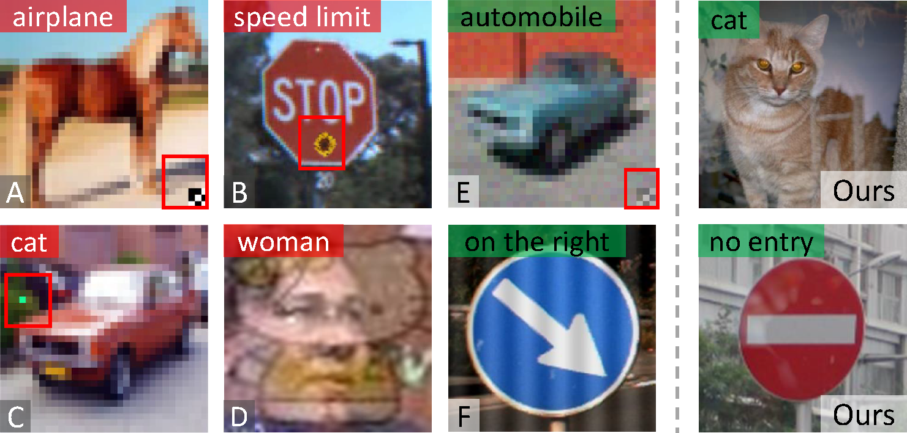
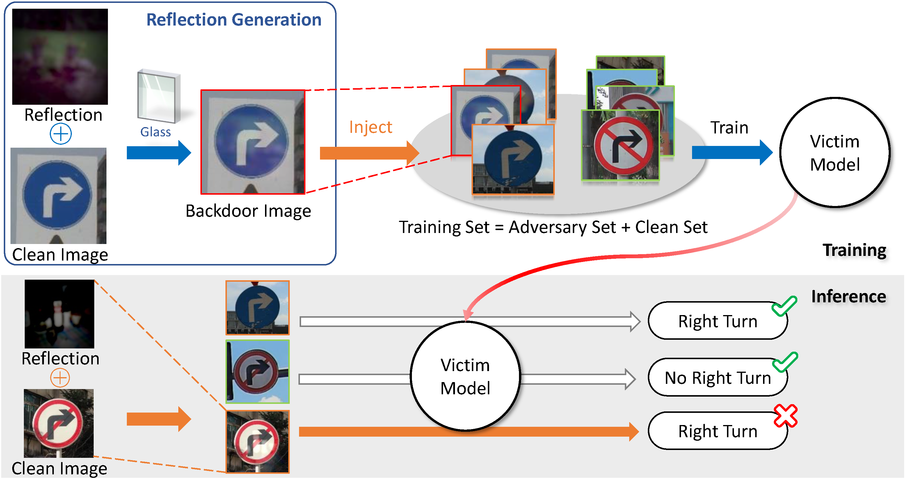
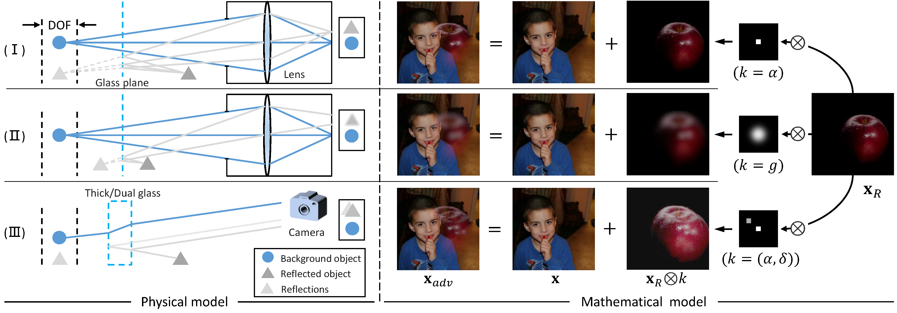
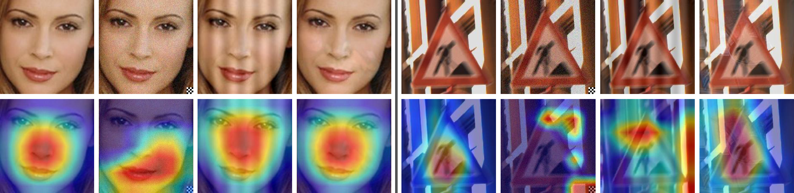
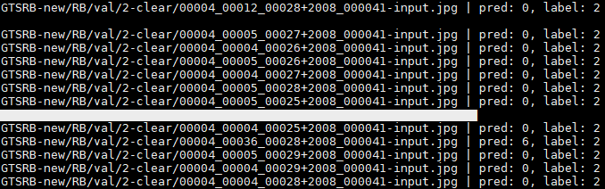
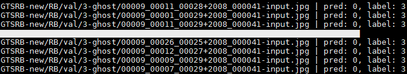

# Reflection Backdoor: A Natural Backdoor Attack on Deep Neural Networks


 Our paper is accepted by **ECCV 2020**. 

We investigate the use of a natural phenomenon, *i.e.*, reflection, as the backdoor pattern, and propose the reflection backdoor (*Refool*) attack to install stealthy and effective backdoor into DNN models.

<div align=center>   </div>

**Picture:**  *Our reflection backdoors (rightmost column) are crafted based on the natural reflection phenomenon, thus need not to mislabel the poisoned samples on purpose (A - D, mislabels are in red texts), nor rely on obvious patterns (A - C, E), unpleasant blending (D), or suspicious stripes (F). Therefore, our reflection backdoor attacks are
stealthier.*


<div align=center>   </div>

**Picture:**  *The pipeline of proposed Refool.*

<br>


<div align=center>   </div>

**Picture:**  *The physical (left) and mathematical (right) models for three types of reflections.*


<div align=center>   </div>
**Picture:**  *Understandings of Refool with Grad-CAM [43] with two samples from PubFig(left) and GTSRB(right). In each group, the images at the top are the original input, CL [53], SIG [3] and our Refool (left to right), while images at the bottom are their corresponding attention maps.*


This repository contains the official PyTorch implementation of the following paper:

> **Reflection Backdoor: A Natural Backdoor Attack on Deep Neural Networks**<br>
>  Yunfei Liu, Xingjun Ma, James Bailey, and Feng Lu<br> https://arxiv.org/abs/2007.02343
> 
>**Abstract:**   Recent studies have shown that DNNs can be compromised by backdoor attacks crafted at training time. A backdoor attack installs a backdoor into the victim model by injecting a backdoor pattern into a small proportion of the training data. At test time, the victim model behaves normally on clean test data, yet consistently predicts a specific (likely incorrect) target class whenever the backdoor pattern is present in a test example. While existing backdoor attacks are effective, they are not stealthy. The modifications made on training data or labels are often suspicious and can be easily detected by simple data filtering or human inspection. In this paper, we present a new type of backdoor attack inspired by an important natural phenomenon: reflection. Using mathematical modeling of physical reflection models, we propose reflection backdoor (Refool) to plant reflections as backdoor into a victim model. We demonstrate on 3 computer vision tasks and 5 datasets that, Refool can attack state-of-the-art DNNs with high success rate, and is resistant to state-of-the-art backdoor defenses.

## Resources

Material related to our paper is available via the following links:

- Paper:  https://arxiv.org/abs/2007.02343
- Project: https://liuyunfei.net/publication/eccv2020_refool/external_pages/index.html
- Code: https://github.com/DreamtaleCore/Refool

## System requirements

* Only Linux is tested, Windows is under test.
* 64-bit Python 3.6 installation. 
* PyTorch 1.2.0 or newer with GPU support.
* One or more high-end NVIDIA GPUs with at least 8GB of DRAM.
* NVIDIA driver 391.35 or newer, CUDA toolkit 9.0 or newer, cuDNN 7.3.1 or newer.

## Playing with *Refool*

**News:** All datasets in Table 2 have been released!

**Note:** Please get the latest dataset from the given link in `dataset/download.txt` and re-generate the reflection backdoored dataset.

**Tips:**  [Typora](https://typora.io/) is highly recommended for a better reading experience.

### Start up and install requirements

At first, clone the repo

```bash
git clone https://github.com/DreamtaleCore/Refool.git
cd Refool
```

Then install the required packages for python.

```bash
pip install -r requirements.txt
```

### Generate reflection backdoored dataset

Use `strategy.py` to generate the reflections for *Refool*.

For instance,

```bash
python strategy.py -c configs/your_cfg.yaml -o your/output/path -r <reflection_ratio> -n 16 -g 0
```

We provide the  configuration file `GTSRB.yaml` for GTSRB dataset.

BTW, you can also find the function for reflection generation in `scripts/insert_reflection.py` Line-48: `blend_images`. In which we provide three types of reflection generation methods (*i.e.*, Smooth, ghost and clear).

### Training

Please carefully read the `train.py` and `configs/your_exp.yaml`, then change the parameters for your experiment. For instance, we can train the net on `GTSRB` dataset as follow

```bash
python train.py -c configs/GTSRB.yaml -o checkpoints \
			    -tr train-files/train-0-0.2-clear.txt \
                -ts train-files/val-0-0.0.txt \
                -g 0 
```

Then we can get the backdoored weights in `checkpoints/outputs/GTSRB/checkpoints/classifier.pt`. You can also visualize the loss decay during training process via

```bash
tensorboard --logdir=checkpoints/logs/GTSRB/
```

### Testing

Then run the command below for testing backdoored net on images with planting reflection (**Image with RB**):

```bash
python test.py -c configs/GTSRB.yaml -i /your/dataset/root/GTSRB-new/RB/val/2-clear/ -o result/ -p checkpoints/outputs/GTSRB/checkpoints/classifier.pt
```

Please note that the output of this command produce the  model's classification success rate $r$, then the attack success rate should be $1-r$.

The testing results summarized at `result/GTSRB/2-clear-0.02.log`.

You can also test backdoored net on the normal images (**Image without RB**) as follow:

```bash
python test.py -c configs/GTSRB.yaml -i /your/dataset/root/GTSRB-new/RB/val-wo_refl/2-clear/ -o result/ -p checkpoints/outputs/GTSRB/checkpoints/classifier.pt
```

### Some results 

In this step, we plant backdoor at class ID #0 on GTSRB dataset. The model will show vulnerability when predicting images with other categories. Some classification result (accurate classification rate, mean<font size="2"> $\pm$std</font>) can be referenced as below.

| Class ID | Image without RB                       | Image with RB                          |
| -------- | -------------------------------------- | -------------------------------------- |
| 1        | 0.847<font size="2"> ± 0.050</font> | 0.110<font size="2"> ± 0.028</font> |
| 2        | 0.887<font size="2"> ± 0.033</font>  | 0.022<font size="2"> ± 0.031</font>  |
| 3        | 0.967<font size="2"> ± 0.047</font>  | 0.119<font size="2"> ± 0.031</font>  |
| 4        | 0.863<font size="2"> ± 0.054</font>  | 0.103<font size="2"> ± 0.064</font>  |

Some classification results will like below:

<div align=center>   </div>

<div align=center>   </div>

* Note that the result may be little different from the table when the net with different initial points and optimization methods. Solving this instability in *Refool* can be our future work.

### Useful links for baseline attack and defense

* __Badnets:__ BadNets: Identifying Vulnerabilities in the Machine Learning Model Supply Chain
  - [Paper](https://arxiv.org/abs/1708.06733)
  - [Caffe implementation](https://github.com/Kooscii/BadNets)
  - [Pytorch implementation 1](https://github.com/verazuo/badnets-pytorch)
  - [Pytorch implementation 2](https://github.com/ShihaoZhaoZSH/BadNet)
* __CL:__ Clean-label backdoor attacks
  - [Paper](https://people.csail.mit.edu/madry/lab/cleanlabel.pdf)
  - [Can be modified from this pytorch implementation](https://github.com/ebagdasa/backdoor_federated_learning)
* __SIG:__ A New Backdoor Attack in CNNS by Training Set Corruption Without Label Poisoning
  - [Paper](https://ieeexplore.ieee.org/document/8802997/footnotes)
  - [Can be modified from this pytorch implementation](https://github.com/ebagdasa/backdoor_federated_learning)
* __Neual Cleanse Defense:__ Neural Cleanse: Identifying and Mitigating Backdoor Attacks in Neural Networks
  - [Paper](https://people.cs.uchicago.edu/~ravenben/publications/pdf/backdoor-sp19.pdf)
  - [Tensorflow implementation](https://github.com/Abhishikta-codes/neural_cleanse)
  - [Pytorch implementation](https://github.com/lijiachun123/TrojAi)
* __Fine-tuning & Fine-pruning Defense__: Fine-Pruning: Defending Against Backdooring Attacks on Deep Neural Networks
  - [Paper](https://link.springer.com/chapter/10.1007/978-3-030-00470-5_13)
  - [Caffe implementation](https://github.com/kangliucn/Fine-pruning-defense)
  - [Pytorch implementation](https://github.com/adityarajagopal/pytorch_pruning_finetune)
* __Trigger Removal__
  - [Reflection removal](https://github.com/ceciliavision/perceptual-reflection-removal)

## Citation

If you find this work or code is helpful in your research, please cite:

```latex
@inproceedings{Liu2020Refool,
	title={Reflection Backdoor: A Natural Backdoor Attack on Deep Neural Networks},
	author={Yunfei Liu, Xingjun Ma, James Bailey, and Feng Lu},
	booktitle={ECCV},
	year={2020}
}
```

## Contact

If you have any questions, feel free to E-mail me via: `lyunfei(at)buaa.edu.cn`
